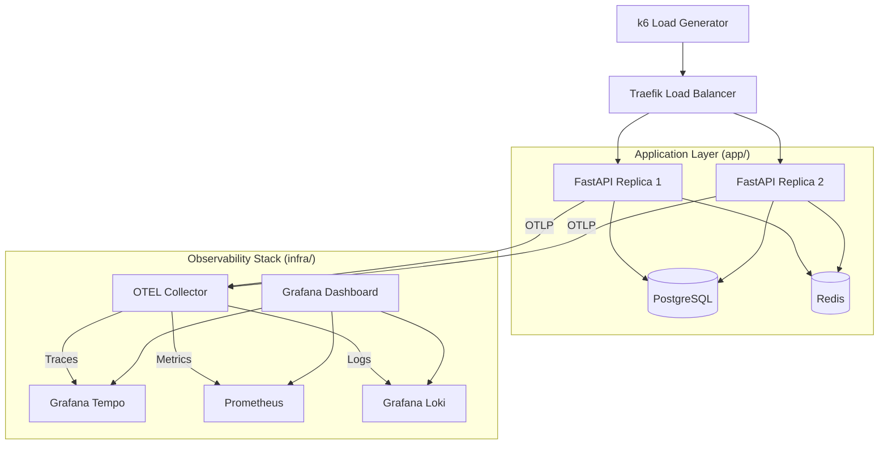

# Observability-Driven Backend Platform (FastAPI + OpenTelemetry Stack)

## Overview

This project is a backend system designed to evaluate observability as a first-class engineering concern in distributed applications. It demonstrates how a production-style FastAPI service behaves under load, failure, and concurrency pressure while being fully instrumented for logs, metrics, and traces.

The focus is not feature delivery, but system-level behavior: how requests propagate, how failures surface, and how quickly the system can be debugged using observability signals.

Key goals:

- End-to-end request visibility across services
- Observable async and concurrent request execution
- Failure detection and debugging through telemetry
- Production-style operational insight under load

## 📁 Project Structure

```
app/
  api/          # API route definitions
  services/     # Business logic
  core/         # Configuration, DB, Redis setup
  telemetry/    # OpenTelemetry instrumentation
  middleware/   # Custom FastAPI middleware
  logging/      # Structured logging setup
  metrics/      # Custom Prometheus metrics

infra/
  grafana/      # Dashboards & Provisioning
  prometheus/   # Metrics collection rules
  tempo/        # Distributed tracing config
  loki/         # Log aggregation config
  otel/         # OTEL Collector config
  traefik/      # Reverse proxy configuration

scripts/
  k6/           # Load testing scripts
```

## 🏗️ Architecture



## 🚀 Key Features

- **Distributed Tracing**: End-to-end trace propagation across FastAPI, SQLAlchemy, and Redis using OpenTelemetry.
- **Structured Logging**: JSON-formatted logs with automatic `trace_id` and `span_id` injection for seamless log-to-trace correlation.
- **RED Metrics**: Pre-calculated Rate, Errors, and Duration metrics exposed via Prometheus.
- **Failure Simulation**: Built-in endpoints to simulate latency spikes, random exceptions, and heavy background tasks.
- **Load Balancing**: Traefik-managed traffic distribution across multiple FastAPI replicas.
- **Automated Provisioning**: Grafana comes pre-configured with datasources and a "Platform Overview" dashboard.

## 🛠️ Tech Stack

- **Backend**: FastAPI, SQLAlchemy, Redis
- **Observability**: OpenTelemetry SDK, OTEL Collector
- **Storage**: PostgreSQL (Persistence), Redis (Caching), MinIO (S3 for Loki/Tempo)
- **Monitoring**: Prometheus (Metrics), Loki (Logs), Tempo (Traces), Grafana (Visualization)
- **Traffic**: Traefik (Reverse Proxy)
- **Testing**: k6 (Load Testing)

## 🚦 Getting Started

### 1. Start the Platform
```bash
docker-compose up -d
```

### 2. Access the Interfaces
- **Grafana**: [http://grafana.localhost](http://grafana.localhost) (admin/password)
- **Traefik Dashboard**: [http://localhost:8080](http://localhost:8080)
- **API Documentation**: [http://server.localhost/docs](http://server.localhost/docs)

### 3. Run Load Tests
Execute the k6 load test suite to generate system activity and telemetry:
```bash
# Standard Load Test
docker-compose run --rm k6 run /scripts/load-test.js

# Retry Storm Simulation
docker-compose run --rm k6 run /scripts/retry-storm.js
```

## 🔍 Observability Workflows

### Distributed Debugging
1. Open the **Platform Overview** dashboard in Grafana.
2. Observe a spike in the "Error Rate" or "Latency" panels.
3. Scroll down to "Application Logs" and click on a log line with an error.
4. Click the **TraceID** link to jump directly into the Tempo trace view.
5. Inspect the trace to see exactly where the failure occurred (FastAPI, DB, or Redis).

### Performance Analysis
- Use the **Latency p95** panel to identify slow routes.
- Observe the **Traefik** metrics to see how traffic is distributed across replicas.
- Check **Postgres Exporter** and **Redis Exporter** for infrastructure-level saturation.

## 🧪 Failure Scenarios

The platform includes specific routes to test system resilience:
- `/simulate/latency`: Randomly delays the response to observe metric shifts and trace durations.
- `/simulate/error`: Randomly throws 500 errors to test alerting and trace error recording.
- `/simulate/heavy-task`: Spawns background tasks to observe async execution behavior.